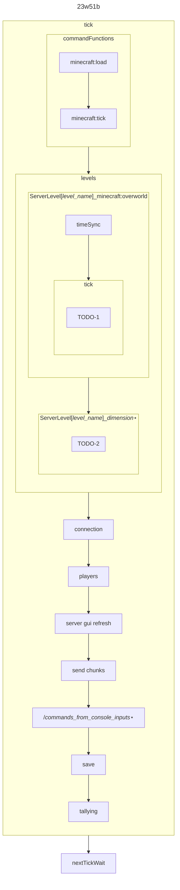

# Tick order

```mermaid
---
title: 23w51b
---
flowchart TB
    subgraph tick
        direction TB
        subgraph tick.commandFunctions[commandFunctions]
            direction TB
            tick.commandFunctions.minecraft:load[minecraft:load]
            tick.commandFunctions.minecraft:tick[minecraft:tick]
            tick.commandFunctions.minecraft:load --> tick.commandFunctions.minecraft:tick
        end
        subgraph tick.levels[levels]
            direction TB
            subgraph tick.levels.overworld["`ServerLevel[*level_name*]_minecraft:overworld`"]
                direction TB
                tick.levels.overworld.timeSync[timeSync]
                subgraph tick.levels.overworld.tick[tick]
                    direction TB
                    TODO-1
                end
                tick.levels.overworld.timeSync --> tick.levels.overworld.tick
            end
            subgraph tick.levels.otherDimension["`ServerLevel[*level_name*]_*dimension*⋆`"]
                direction TB
                subgraph TODO-2
                    direction TB
                end
            end
            tick.levels.overworld --> tick.levels.otherDimension
        end
        tick.connection[connection]
        tick.players[players]
        tick.server_gui_refresh[server gui refresh]
        tick.send_chunks[send chunks]
        tick.command_from_console_inputs["`/*commands_from_console_inputs*⋆`"]
        tick.save[save]
        tick.tallying[tallying]
        tick.commandFunctions --> tick.levels
        tick.levels --> tick.connection
        tick.connection --> tick.players
        tick.players --> tick.server_gui_refresh
        tick.server_gui_refresh --> tick.send_chunks
        tick.send_chunks --> tick.command_from_console_inputs
        tick.command_from_console_inputs --> tick.save
        tick.save --> tick.tallying
    end
    nextTickWait
    tick --> nextTickWait
```
